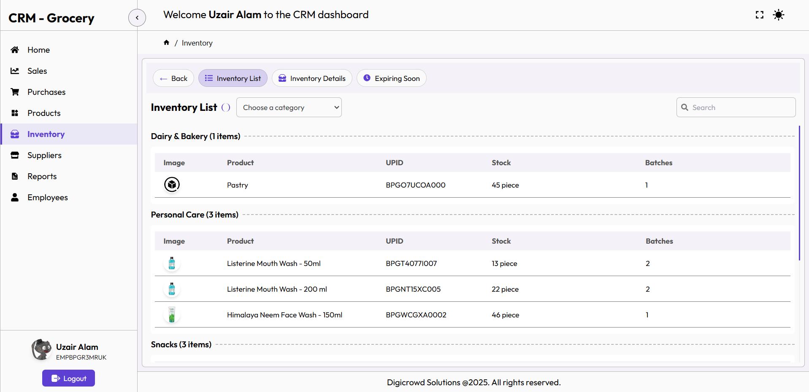

# CRM Grocery 🏪

A modern Customer Relationship Management system designed specifically for grocery stores. Manage inventory, track sales, handle supplier relationships, and monitor customer interactions all in one place.

[](https://crm-grocery.netlify.app)
[](LICENSE)
[](https://github.com/Armin1723/crm-grocery/issues)

[View Demo](https://crm-grocery.netlify.app) • [Report Bug](https://github.com/Armin1723/crm-grocery/issues) • [Request Feature](https://github.com/Armin1723/crm-grocery/issues)

## 📋 Table of Contents
- [Overview](#overview)
- [Features](#features)
- [Demo](#demo)
- [Tech Stack](#tech-stack)
- [Getting Started](#getting-started)
  - [Prerequisites](#prerequisites)
  - [Installation](#installation)
  - [Environment Setup](#environment-setup)
- [Project Structure](#project-structure)
- [Usage](#usage)
- [Contributing](#contributing)
- [License](#license)
- [Contact](#contact)

## 🎯 Overview

CRM Grocery is your one-stop solution for managing grocery store operations efficiently. Whether you're handling inventory, tracking sales, managing suppliers, or maintaining customer relationships, our system provides a seamless experience with a modern, user-friendly interface.

## ✨ Features

### 📦 Inventory Management
- **Stock Tracking**
  - Real-time stock level monitoring
  - Automated low stock alerts
  - Batch tracking capabilities
- **Product Categories**
  - Hierarchical category management
  - Custom category creation
  - Category-wise reporting
- **Reorder Management**
  - Customizable reorder points
  - Automated reorder notifications
  - Order history tracking
- **Expiry Tracking**
  - Expiry date monitoring
  - FIFO/LIFO management
  - Expiry alerts system

### 🤝 Supplier Management
- **Supplier Profiles**
  - Detailed supplier information
  - Performance metrics tracking
  - Document management
- **Purchase Orders**
  - Digital PO creation
  - Order tracking system
  - Bulk order management
- **Payment Tracking**
  - Payment schedule management
  - Payment history records
  - Outstanding payment tracking
- **Invoice Management**
  - Digital invoice storage
  - Invoice processing
  - Payment reconciliation

### 💹 Sales Tracking
- **Transaction Management**
  - Quick sale processing
  - Multiple payment methods
  - Returns handling
- **Invoicing System**
  - Automated invoice generation
  - Customizable invoice templates
  - Digital invoice storage
- **Payment Management**
  - Real-time payment tracking
  - Payment status updates
  - Payment method analytics
- **Analytics**
  - Sales trend analysis
  - Revenue reports
  - Product performance metrics

### 👥 Customer Management
- **Customer Database**
  - Detailed customer profiles
  - Contact information management
  - Purchase history tracking
- **Loyalty System**
  - Points management
  - Reward tracking
  - Special offers handling
- **Feedback System**
  - Customer feedback collection
  - Rating system
  - Feedback analysis tools

## 🖥️ Demo

Visit our [live demo](https://crm-grocery.netlify.app) to explore the features.

> Dashboard 
>    
> 
>  
> Dashboard Dark Mode
>   
> 
>
> Inventory List Item
>
> 
>
> Sales View
>
> 

## 🛠️ Tech Stack

- **Frontend**
  - React.js - UI development
  - TailwindCSS - Styling
  - Context API - State management
  - React Router - Navigation

- **Backend**
  - Node.js - Runtime environment
  - Express - Backend framework
  - MongoDB - Database
  - JWT - Authentication

## 🚀 Getting Started

### Prerequisites

- Node.js (v14.0.0 or higher)
- npm (v6.0.0 or higher)
- MongoDB (local or Atlas)

### Installation

1. **Clone the Repository**
   ```bash
   git clone https://github.com/Armin1723/crm-grocery.git
   cd crm-grocery
   ```

2. **Install Dependencies**
   ```bash
   npm install
   ```

3. **Start Development Server**
   ```bash
   npm run dev
   ```

### Environment Setup

Create a `.env` file in the root directory:

```env
MONGODB_URI=your_mongodb_uri
JWT_SECRET=your_jwt_secret
PORT=3000
```

## 📁 Project Structure

```
crm-grocery/
├── src/
│   ├── components/     # Reusable UI components
│   ├── pages/         # Page components
│   ├── context/       # Context providers
│   ├── utils/         # Utility functions
│   └── App.jsx        # Main application component
├── public/            # Static files
└── package.json       # Project dependencies
```

## 💡 Usage

1. **Login/Register**
   - Create an account or login
   - Set up your store profile

2. **Inventory Management**
   - Add products
   - Set up categories
   - Configure alerts

3. **Supplier Operations**
   - Add suppliers
   - Create purchase orders
   - Track deliveries

4. **Sales Management**
   - Process sales
   - Generate invoices
   - Track payments

5. **Customer Management**
   - Add customers
   - Track loyalty points
   - Manage feedback

## 🤝 Contributing

We welcome contributions! Here's how you can help:

1. Fork the repository
2. Create your feature branch (`git checkout -b feature/AmazingFeature`)
3. Commit your changes (`git commit -m 'Add some AmazingFeature'`)
4. Push to the branch (`git push origin feature/AmazingFeature`)
5. Open a Pull Request

Please ensure your PRs are well-documented and maintain consistent coding style.

## 📄 License

This project is licensed under the MIT License - see the [LICENSE](LICENSE) file for details.

## 📞 Contact

Armin1723 - [GitHub Profile](https://github.com/Armin1723)

Project Link: [https://github.com/Armin1723/crm-grocery](https://github.com/Armin1723/crm-grocery)
